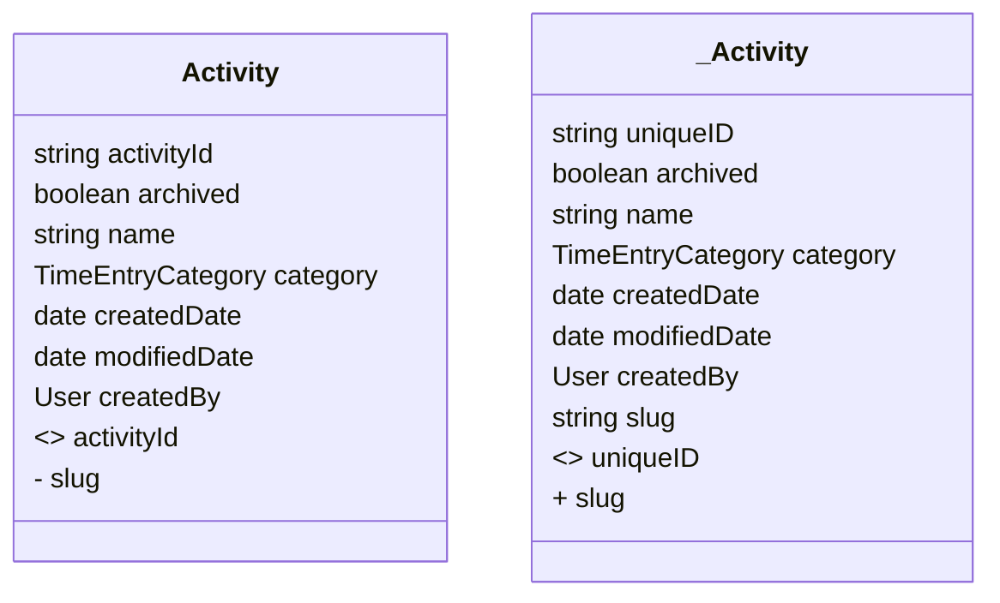

```mermaid
classDiagram
class Activity {
	string activityId
	boolean archived
	string name
	TimeEntryCategory category
	date createdDate
	date modifiedDate
	User createdBy
}

class _Activity {
	string uniqueID
	boolean archived
	string name
	TimeEntryCategory category
	date createdDate
	date modifiedDate
	User createdBy
	string slug
}
    Activity: <> activityId
    _Activity: <> uniqueID
    _Activity : + slug
    Activity : - slug
```