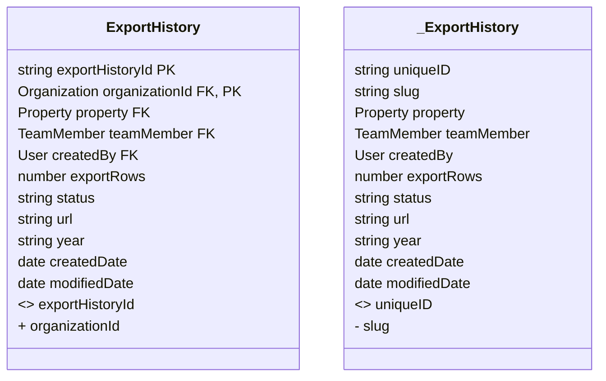

```mermaid
classDiagram
class ExportHistory {
	string exportHistoryId PK
	Organization organizationId FK, PK
	Property property FK
	TeamMember teamMember FK
    User createdBy FK
	number exportRows
	string status
	string url
	string year
	date createdDate
	date modifiedDate
}

class _ExportHistory {
    string uniqueID
	string slug
	Property property
	TeamMember teamMember
    User createdBy
    number exportRows
	string status
	string url
	string year
	date createdDate
	date modifiedDate
}
    _ExportHistory: <> uniqueID
    ExportHistory: <> exportHistoryId
    ExportHistory : + organizationId
     _ExportHistory : - slug
```