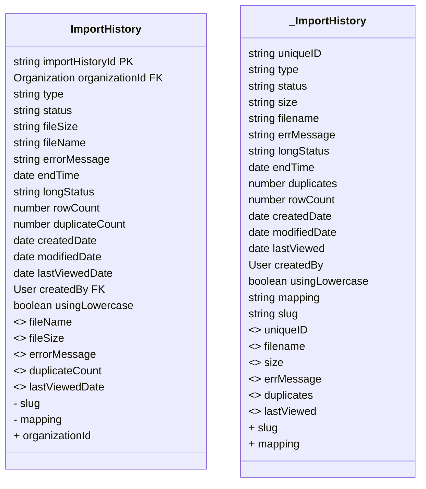

```mermaid
classDiagram
class ImportHistory {
	string importHistoryId PK
	Organization organizationId FK
	string type
	string status
	string fileSize
	string fileName
	string errorMessage
	date endTime
	
	string longStatus
	
	number rowCount
	number duplicateCount
	
	date createdDate
	date modifiedDate
	date lastViewedDate
	User createdBy FK
	boolean usingLowercase
}


class _ImportHistory {
    string uniqueID

    string type
	string status
    string size
    string filename
    string errMessage
    string longStatus
	date endTime

    number duplicates
	number rowCount

	date createdDate
	date modifiedDate
    date lastViewed
    User createdBy

	boolean usingLowercase
    string mapping
    string slug
}
    _ImportHistory : <> uniqueID
    ImportHistory : <> fileName 
    _ImportHistory : <> filename
    ImportHistory : <> fileSize 
    _ImportHistory : <> size
    ImportHistory : <> errorMessage 
    _ImportHistory : <> errMessage
    ImportHistory : <> duplicateCount 
    _ImportHistory : <> duplicates
    ImportHistory : <> lastViewedDate 
    _ImportHistory : <> lastViewed
    ImportHistory : - slug
    ImportHistory : - mapping
    _ImportHistory : + slug
    _ImportHistory : + mapping
	ImportHistory : + organizationId
```