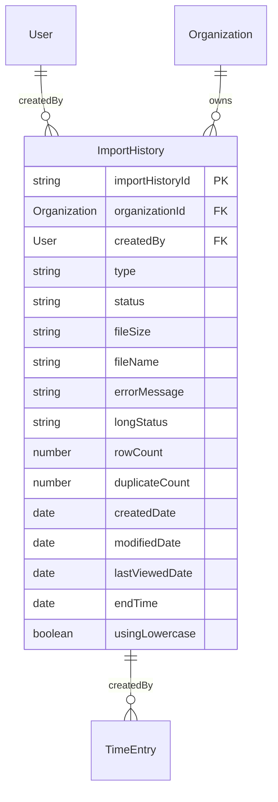

```mermaid
erDiagram

ImportHistory ||--o{ TimeEntry : createdBy
User ||--o{ ImportHistory : createdBy
Organization ||--o{ ImportHistory : owns

ImportHistory {
	string importHistoryId PK
	Organization organizationId FK
	User createdBy FK
	
	string type
	string status
	string fileSize
	string fileName
	string errorMessage
	string longStatus
	
	number rowCount
	number duplicateCount
	
	date createdDate
	date modifiedDate
	date lastViewedDate
	date endTime
	
	boolean usingLowercase
	
}
```