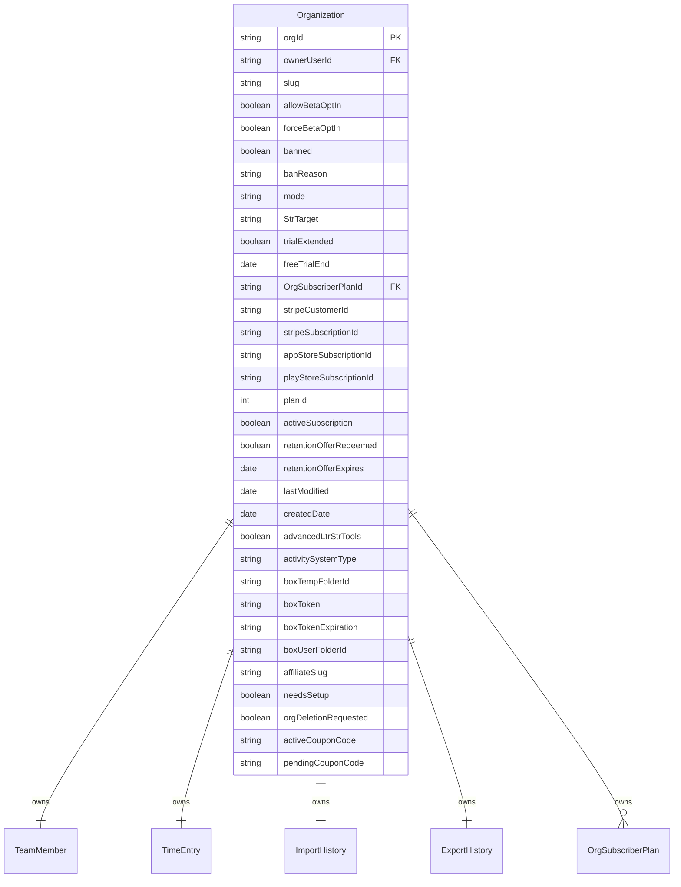

```mermaid
erDiagram

Organization ||--|| TeamMember : owns
Organization ||--|| TimeEntry : owns
Organization ||--|| ImportHistory : owns
Organization ||--|| ExportHistory : owns
Organization ||--o{ OrgSubscriberPlan : owns

Organization {
    string orgId PK
    string ownerUserId FK
    string slug

    boolean allowBetaOptIn
    boolean forceBetaOptIn

    boolean banned
    string banReason

    string mode
    string StrTarget

    boolean trialExtended
    date freeTrialEnd

    string OrgSubscriberPlanId FK

    string stripeCustomerId
    string stripeSubscriptionId
    string appStoreSubscriptionId
    string playStoreSubscriptionId
    int planId
    boolean activeSubscription

    boolean retentionOfferRedeemed
    date retentionOfferExpires 

    date lastModified
    date createdDate

    boolean advancedLtrStrTools
    string activitySystemType

    string boxTempFolderId
    string boxToken
    string boxTokenExpiration
    string boxUserFolderId

    string affiliateSlug
    boolean needsSetup
    boolean orgDeletionRequested
    string activeCouponCode
    string pendingCouponCode
}
```