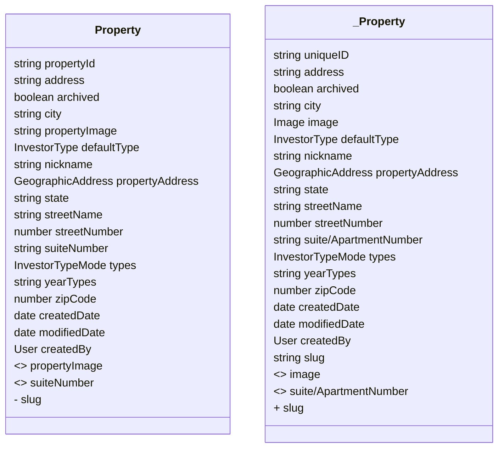

```mermaid
classDiagram

class Property {
    string propertyId
	string address
	boolean archived
	string city
	string propertyImage
	InvestorType defaultType
	string nickname
	GeographicAddress propertyAddress
	string state
	string streetName
	number streetNumber
	string suiteNumber
	InvestorTypeMode types
	string yearTypes
	number zipCode
	date createdDate
	date modifiedDate
	User createdBy
}


class _Property {
    string uniqueID
	string address
	boolean archived
	string city
	Image image
	InvestorType defaultType
	string nickname
	GeographicAddress propertyAddress
	string state
	string streetName
	number streetNumber
	string suite/ApartmentNumber
	InvestorTypeMode types
	string yearTypes
	number zipCode
	date createdDate
	date modifiedDate
	User createdBy
	string slug
}
    Property: <> propertyImage
    _Property : <> image
    _Property : <> suite/ApartmentNumber
    Property : <> suiteNumber

    _Property : + slug
    Property : - slug
```