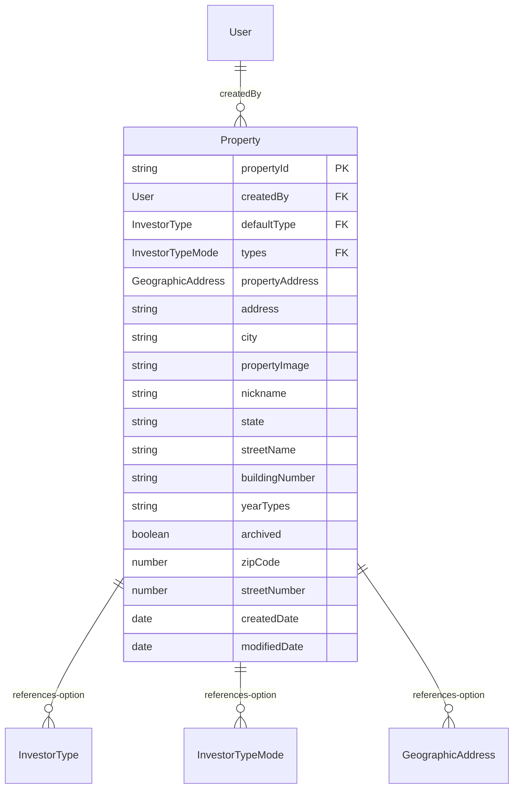

```mermaid
erDiagram
User ||--o{ Property : createdBy
Property ||--o{ InvestorType : references-option
Property ||--o{ InvestorTypeMode : references-option
Property ||--o{ GeographicAddress : references-option

Property {
	string propertyId PK
	User createdBy FK
	InvestorType defaultType FK
	InvestorTypeMode types FK
	GeographicAddress propertyAddress 

	string address
	string city
	string propertyImage
	string nickname
	string state
	string streetName
	string buildingNumber
	string yearTypes

	boolean archived

	number zipCode
	number streetNumber

	date createdDate
	date modifiedDate
}
```