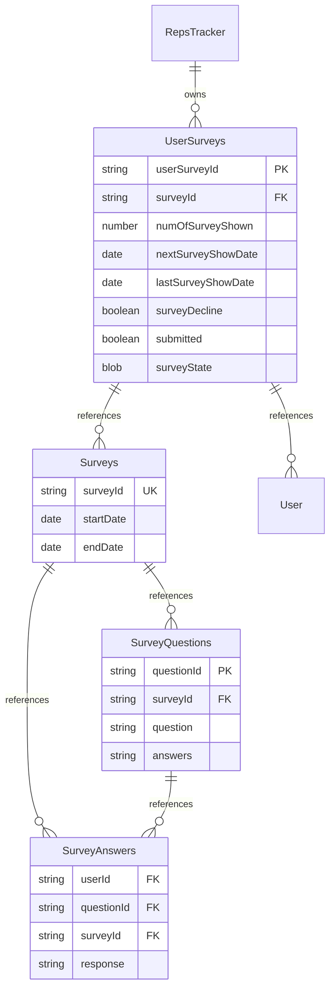

```mermaid
erDiagram
RepsTracker ||--o{ UserSurveys : owns
UserSurveys ||--o{ Surveys : references
UserSurveys ||--o{ User : references
Surveys ||--o{ SurveyQuestions : references
Surveys ||--o{ SurveyAnswers : references
SurveyQuestions ||--o{ SurveyAnswers : references

Surveys {
	string surveyId UK
    date startDate
    date endDate
}

SurveyQuestions {
    string questionId PK
    string surveyId FK
    string question
    string answers
}

SurveyAnswers {
    string userId FK
    string questionId FK
    string surveyId FK
    string response
}

UserSurveys {
	string userSurveyId PK
	string surveyId FK
	number numOfSurveyShown
	date nextSurveyShowDate
	date lastSurveyShowDate
	boolean surveyDecline
	boolean submitted
	
	blob surveyState
}
```