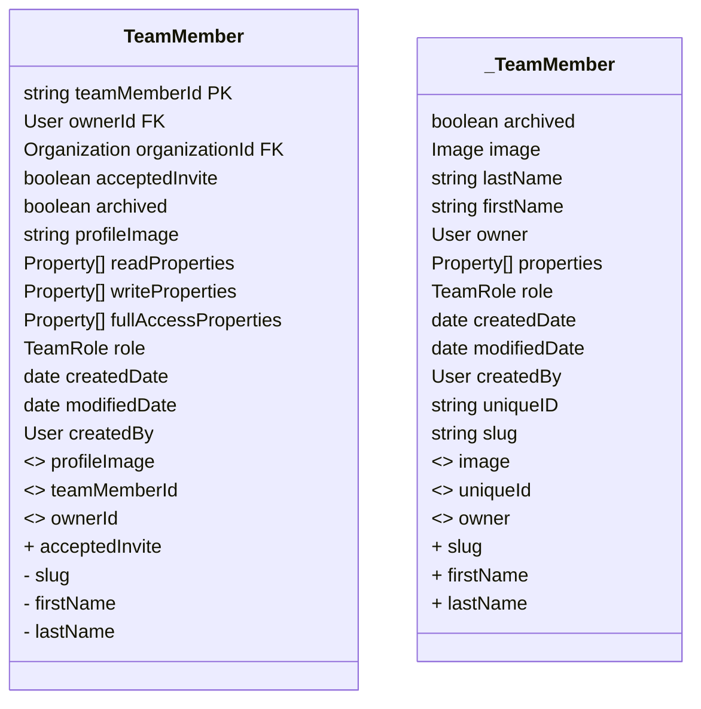

```mermaid
classDiagram

class TeamMember {
	string teamMemberId PK
	User ownerId FK
	Organization organizationId FK
	boolean acceptedInvite
	boolean archived

	string profileImage
	Property[] readProperties 
	Property[] writeProperties
	Property[] fullAccessProperties
	TeamRole role

	date createdDate
	date modifiedDate
	User createdBy

}

class _TeamMember {
	boolean archived
	Image image
	string lastName
	string firstName
	User owner
	Property[] properties
	TeamRole role
	date createdDate
	date modifiedDate
	User createdBy
	string uniqueID
	string slug
}
    TeamMember: <> profileImage
    _TeamMember : <> image

	TeamMember: <> teamMemberId
    _TeamMember : <> uniqueId

	TeamMember : <> ownerId
	_TeamMember : <> owner

    TeamMember : + acceptedInvite
    TeamMember : - slug
	_TeamMember : + slug
	TeamMember : - firstName
	TeamMember : - lastName
	_TeamMember : + firstName
	_TeamMember : + lastName
```