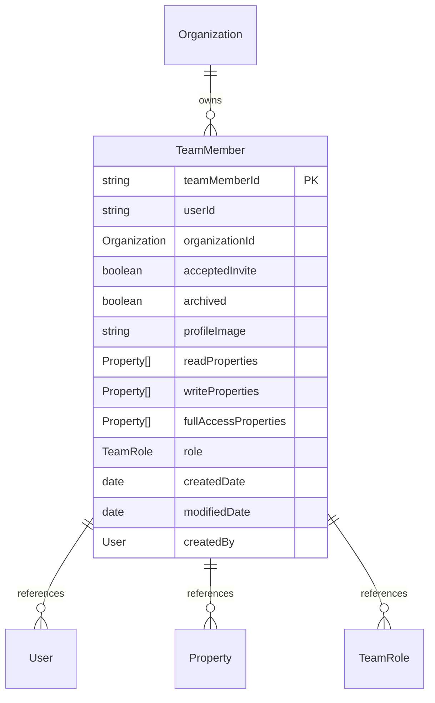

```mermaid
erDiagram

Organization ||--o{ TeamMember : owns
TeamMember ||--o{ User : references
TeamMember ||--o{ Property : references
TeamMember ||--o{ TeamRole : references
TeamMember {
	string teamMemberId PK
	string userId
	Organization organizationId
	boolean acceptedInvite
	boolean archived

	string profileImage
	Property[] readProperties
	Property[] writeProperties
	Property[] fullAccessProperties
	TeamRole role

	date createdDate
	date modifiedDate
	User createdBy

}
	
```