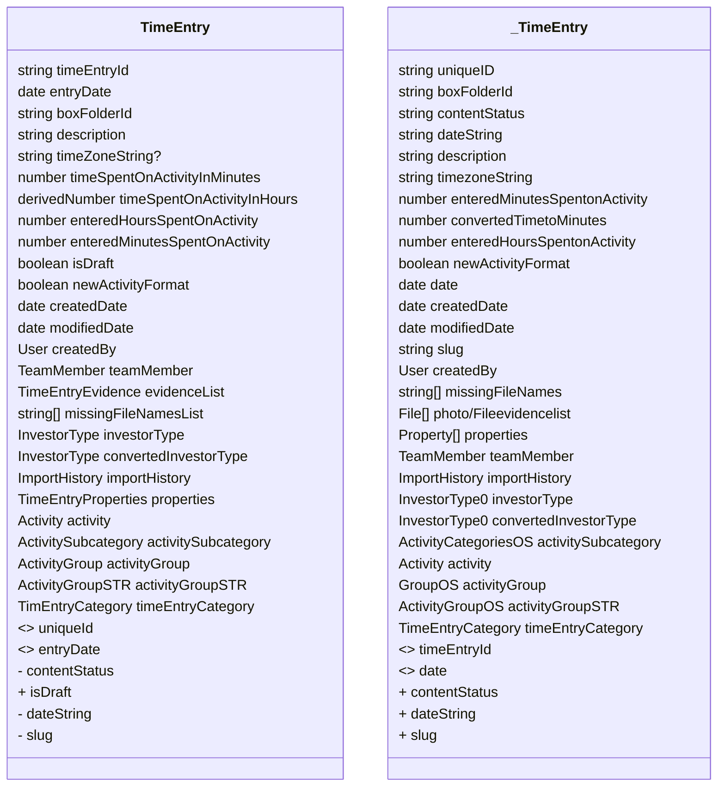

```mermaid
classDiagram

class TimeEntry {
	string timeEntryId
	
    date entryDate
	
	string boxFolderId
	string description
	string timeZoneString?
	
	number timeSpentOnActivityInMinutes
	derivedNumber timeSpentOnActivityInHours
	number enteredHoursSpentOnActivity
	number enteredMinutesSpentOnActivity

	boolean isDraft
	boolean newActivityFormat
	
	date createdDate
	date modifiedDate
	User createdBy
	
	TeamMember teamMember
	
	TimeEntryEvidence evidenceList
	string[] missingFileNamesList
	
	InvestorType investorType
	InvestorType convertedInvestorType
	ImportHistory importHistory
	
	TimeEntryProperties properties
	Activity activity
	ActivitySubcategory activitySubcategory
	ActivityGroup activityGroup
	ActivityGroupSTR activityGroupSTR

    TimEntryCategory timeEntryCategory
}

class _TimeEntry {
	string uniqueID
	string boxFolderId
	string contentStatus
	string dateString
	string description
	string timezoneString

	number enteredMinutesSpentonActivity
	number convertedTimetoMinutes
	number enteredHoursSpentonActivity
	
	boolean newActivityFormat

	date date
	date createdDate
	date modifiedDate
	
	string slug
	User createdBy
	string[] missingFileNames
	File[] photo/Fileevidencelist
	Property[] properties
	TeamMember teamMember
	ImportHistory importHistory
	InvestorType0 investorType
	InvestorType0 convertedInvestorType
	ActivityCategoriesOS activitySubcategory
	Activity activity
	GroupOS activityGroup
	ActivityGroupOS activityGroupSTR
	TimeEntryCategory timeEntryCategory
}
	TimeEntry : <> uniqueId
	_TimeEntry : <> timeEntryId
	TimeEntry : <> entryDate
	_TimeEntry : <> date
	TimeEntry : - contentStatus
	_TimeEntry : + contentStatus
	TimeEntry : + isDraft
	TimeEntry : - dateString
	_TimeEntry : + dateString
	TimeEntry : - slug
	_TimeEntry : + slug
```