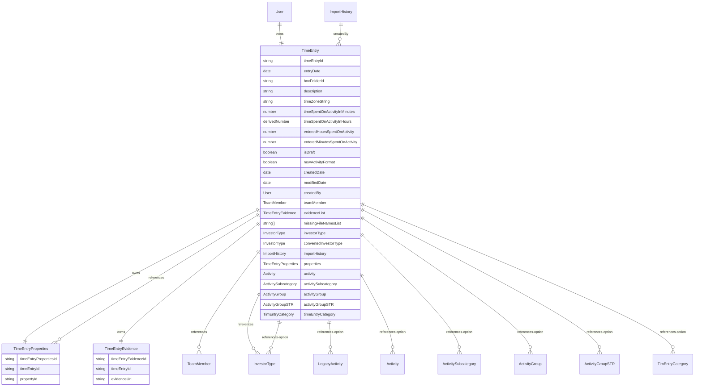

```mermaid
erDiagram

TimeEntry ||--|| TimeEntryProperties : owns
TimeEntry ||--|| TimeEntryEvidence : owns
User ||--|| TimeEntry : owns
ImportHistory ||--o{ TimeEntry : createdBy
TimeEntry ||--o{ TeamMember : references
TimeEntry ||--o{ InvestorType : references
TimeEntry ||--o{ TimeEntryProperties : references
TimeEntry ||--o{ InvestorType : references-option
TimeEntry ||--o{ LegacyActivity : references-option
TimeEntry ||--o{ Activity : references-option
TimeEntry ||--o{ ActivitySubcategory : references-option
TimeEntry ||--o{ ActivityGroup : references-option
TimeEntry ||--o{ ActivityGroupSTR : references-option
TimeEntry ||--o{ TimEntryCategory : references-option

TimeEntry {
	string timeEntryId
	
    date entryDate
	
	string boxFolderId
	string description
	string timeZoneString
	
	number timeSpentOnActivityInMinutes
	derivedNumber timeSpentOnActivityInHours
	number enteredHoursSpentOnActivity
	number enteredMinutesSpentOnActivity

	boolean isDraft
	boolean newActivityFormat
	
	date createdDate
	date modifiedDate
	User createdBy
	
	TeamMember teamMember
	
	TimeEntryEvidence evidenceList
	string[] missingFileNamesList
	
	InvestorType investorType
	InvestorType convertedInvestorType
	ImportHistory importHistory
	
	TimeEntryProperties properties
	Activity activity
	ActivitySubcategory activitySubcategory
	ActivityGroup activityGroup
	ActivityGroupSTR activityGroupSTR

    TimEntryCategory timeEntryCategory
}
	
TimeEntryProperties {
	string timeEntryPropertiesId
	string timeEntryId
	string propertyId
}

TimeEntryEvidence {
	string timeEntryEvidenceId
	string timeEntryId
	string evidenceUrl
}
```