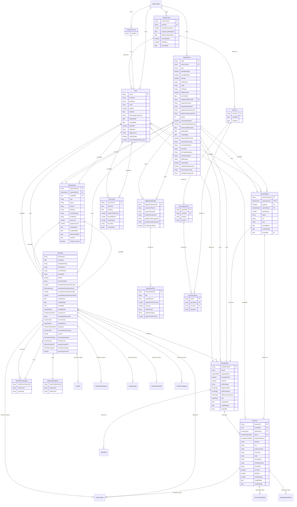

# Full ERD Diagram

```mermaid
erDiagram
RepsTracker ||--o{ User : owns
RepsTracker ||--o{ Organization : owns
RepsTracker ||--o{ CognitoAccount : owns
CognitoAccount ||--|| User : owns

RepsTracker {}

CognitoAccount {
    string cognitoId
}


Organization ||--o{ ExportHistory : createdBy
User }o--o{ ExportHistory : createdBy
ExportHistory ||--|| Property : references
ExportHistory ||--|| TeamMember : references
ExportHistory {
	string exportHistoryId PK
	Organization organizationId FK, PK
	Property property FK
	TeamMember teamMember FK
	number exportRows
	string status
	string url
	string year
	date createdDate
	date modifiedDate
	User createdBy FK
}


ImportHistory ||--o{ TimeEntry : createdBy
User ||--o{ ImportHistory : createdBy
Organization ||--o{ ImportHistory : owns

ImportHistory {
	string importHistoryId PK
	Organization organizationId FK
	User createdBy FK
	
	string type
	string status
	string fileSize
	string fileName
	string errorMessage
	string longStatus
	
	number rowCount
	number duplicateCount
	
	date createdDate
	date modifiedDate
	date lastViewedDate
	date endTime
	
	boolean usingLowercase
	
}


Organization ||--|| TeamMember : owns
Organization ||--|| TimeEntry : owns
Organization ||--|| ImportHistory : owns
Organization ||--|| ExportHistory : owns
Organization ||--o{ OrgSubscriberPlan : owns

Organization {
    string orgId PK
    string ownerUserId FK
    string slug

    boolean allowBetaOptIn
    boolean forceBetaOptIn

    boolean banned
    string banReason

    string mode
    string StrTarget

    boolean trialExtended
    date freeTrialEnd

    string OrgSubscriberPlanId FK

    string stripeCustomerId
    string stripeSubscriptionId
    string appStoreSubscriptionId
    string playStoreSubscriptionId
    int planId
    boolean activeSubscription

    boolean retentionOfferRedeemed
    date retentionOfferExpires 

    date lastModified
    date createdDate

    boolean advancedLtrStrTools
    string activitySystemType

    string boxTempFolderId
    string boxToken
    string boxTokenExpiration
    string boxUserFolderId

    string affiliateSlug
    boolean needsSetup
    boolean orgDeletionRequested
    string activeCouponCode
    string pendingCouponCode
}


User ||--o{ Property : createdBy
Property ||--o{ InvestorType : references-option
Property ||--o{ InvestorTypeMode : references-option
Property ||--o{ GeographicAddress : references-option

Property {
	string propertyId PK
	User createdBy FK
	InvestorType defaultType FK
	InvestorTypeMode types FK
	GeographicAddress propertyAddress 

	string address
	string city
	string propertyImage
	string nickname
	string state
	string streetName
	string buildingNumber
	string yearTypes

	boolean archived

	number zipCode
	number streetNumber

	date createdDate
	date modifiedDate
}


Organization ||--o{ OrgSubscriberPlan : owns
OrgSubscriberPlan ||--o{ SubscriberPlan : references

SubscriberPlan {
	string subscriberPlanId PK
    string title
	string androidPlanId
	number androidPricePerPeriod
	boolean isAnnual
	string stripePriceId
	string stripePriceIdDev
	number stripePricePerPeriod
}

OrgSubscriberPlan {
	string OrgSubscriberPlanId PK
	string subscriberPlanId
    string stripeCustomerId
    string stripeSubscriptionId
    string appStoreSubscriptionId
    string playStoreSubscriptionId
    boolean activeSubscription
}


RepsTracker ||--o{ UserSurveys : owns
UserSurveys ||--o{ Surveys : references
UserSurveys ||--o{ User : references
Surveys ||--o{ SurveyQuestions : references
Surveys ||--o{ SurveyAnswers : references
SurveyQuestions ||--o{ SurveyAnswers : references

Surveys {
	string surveyId UK
    date startDate
    date endDate
}

SurveyQuestions {
    string questionId PK
    string surveyId FK
    string question
    string answers
}

SurveyAnswers {
    string userId FK
    string questionId FK
    string surveyId FK
    string response
}

UserSurveys {
	string userSurveyId PK
	string surveyId FK
	number numOfSurveyShown
	date nextSurveyShowDate
	date lastSurveyShowDate
	boolean surveyDecline
	boolean submitted
	
	blob surveyState
}


Organization ||--o{ TeamMember : owns
TeamMember ||--o{ User : references
TeamMember ||--o{ Property : references
TeamMember ||--o{ TeamRole : references
TeamMember {
	string teamMemberId PK
	string userId
	Organization organizationId
	boolean acceptedInvite
	boolean archived

	string profileImage
	Property[] readProperties
	Property[] writeProperties
	Property[] fullAccessProperties
	TeamRole role

	date createdDate
	date modifiedDate
	User createdBy

}
	


TimeEntry ||--|| TimeEntryProperties : owns
TimeEntry ||--|| TimeEntryEvidence : owns
User ||--|| TimeEntry : owns
ImportHistory ||--o{ TimeEntry : createdBy
TimeEntry ||--o{ TeamMember : references
TimeEntry ||--o{ InvestorType : references
TimeEntry ||--o{ TimeEntryProperties : references
TimeEntry ||--o{ InvestorType : references-option
TimeEntry ||--o{ Activity : references-option
TimeEntry ||--o{ ActivitySubcategory : references-option
TimeEntry ||--o{ ActivityGroup : references-option
TimeEntry ||--o{ ActivityGroupSTR : references-option
TimeEntry ||--o{ TimEntryCategory : references-option

TimeEntry {
	string timeEntryId
	
    date entryDate
	string entryDateString
	
	string boxFolderId
	
	string contentStatus
	string description
	
	boolean isDraft

	string timeZoneString
	
	number timeSpentOnActivityInMinutes
	derivedNumber timeSpentOnActivityInHours
	number enteredHoursSpentOnActivity
	number enteredMinutesSpentOnActivity
	
	date createdDate
	date modifiedDate
	User createdBy
	
	TeamMember teamMember
	
	TimeEntryEvidence evidenceList
	string missingFileNamesList
	
	InvestorType investorType
	ImportHistory importHistory
	
	TimeEntryProperties properties
	InvestorType convertedInvestorType
	Activity activity
	ActivitySubcategory activitySubcategory
	ActivityGroup activityGroup
	ActivityGroupSTR activityGroupSTR

    TimEntryCategory timeEntryCategory
	
	boolean newActivityFormat
}
	
TimeEntryProperties {
	string timeEntryPropertiesId
	string timeEntryId
	string propertyId
}

TimeEntryEvidence {
	string timeEntryEvidenceId
	string timeEntryId
	string evidenceUrl
}


User ||--o{ TimeEntry : createdBy
User ||--o{ UserTimers : createdBy
User {
    string userId PK
    string firstName
    string lastName
    string email

    boolean isAdmin

    date lastSeen
    string lastChangeLogVersion
    date lastModified
    date createdDate

    boolean betaOptIn

    string ZoldEmail
    string loggingLevel

    boolean isOnboarded
    boolean accountDeletionRequested
}


User ||--o{ UserTimers : createdBy
UserTimers {
	string userTimerId PK
	date startTime
	date endTime
	number pauseTimeAccrual
	number timeInMinutes
	number timeInHours
	string hoursText
	string minutesText
}


```
