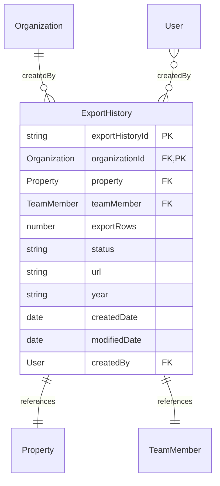
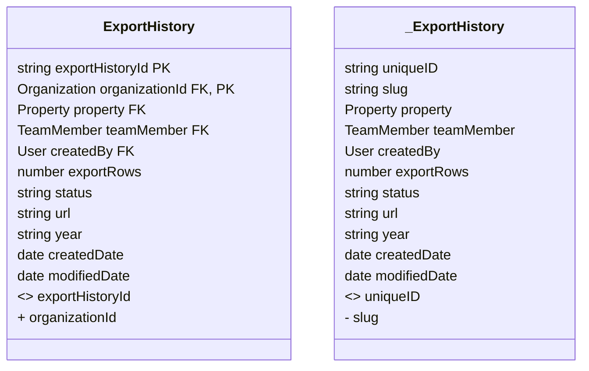

# Export History Migration Details 

## Table Of Contents
- [Notable Questions](#notable-questions)
- [Notes](#notes)
- [Diagram Details](#diagram-details)
- [Bubble Diff](#bubble-diff)

## Notable Questions

- In reference to export history, there is a 'createdBy' value for references the user that made the export history but there is also a Team Member object to reference as well.  I also see a Property object, so I'm assuming that TeamMember and Property are filter values that were used to create the export, but I just wanted to verify before making any assumptions

### Notes
**1. Renamed Attributes (<>):**

- *uniqueID* (in _ExportHistory) is renamed to *exportHistoryId* in ExportHistory.

**2. Removed Attributes (-):**

- *slug* has been removed from ExportHistory.

**3. Added Attributes (+):**

- *organizationId* is added in ExportHistory.

### Diagram Details

### Bubble Diff

