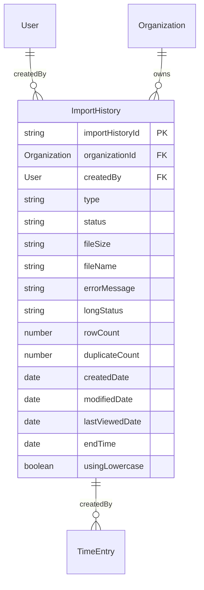
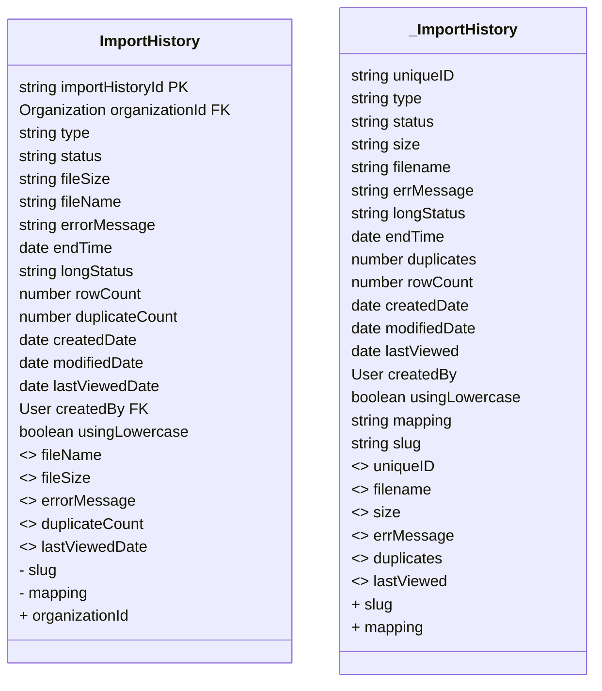

# Import History Migration Details 

## Table Of Contents
- [Notes](#notes)
- [Diagram Details](#diagram-details)
- [Bubble Diff](#bubble-diff)

### Notes
**1. Renamed Attributes (<>):**

- *uniqueID* (in _ImportHistory) is renamed to *importHistoryId* in ImportHistory.
- *filename* (in _ImportHistory) is renamed to *fileName* in ImportHistory.
- *size* (in _ImportHistory) is renamed to *fileSize* in ImportHistory.
- *errMessage* (in _ImportHistory) is renamed to *errorMessage* in ImportHistory.
- *duplicates* (in _ImportHistory) is renamed to *duplicateCount* in ImportHistory.
- *lastViewed* (in _ImportHistory) is renamed to *lastViewedDate* in ImportHistory.

**2. Removed Attributes (-):**

- *slug* has been removed from ImportHistory.
- *mapping* has been removed from ImportHistory .

**3. Added Attributes (+):**

- *organizationId* is added in ImportHistory.

### Diagram Details

### Bubble Diff

