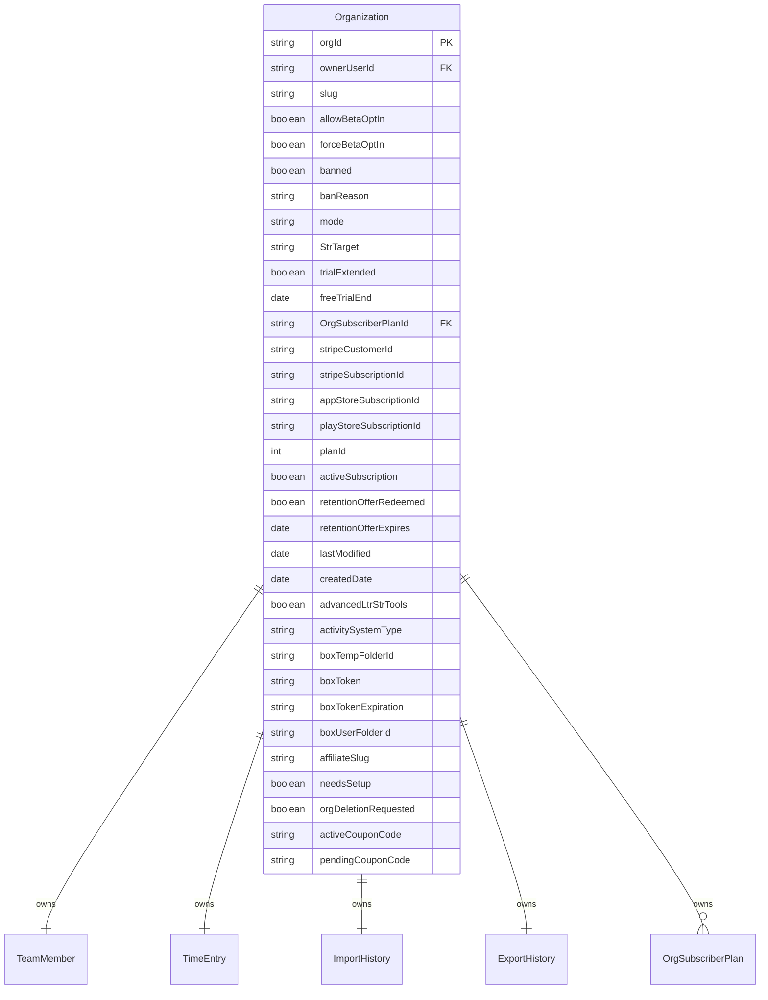

# Organization Migration Details 

## Table Of Contents
- [Notes](#notes)
- [Diagram Details](#diagram-details)

### Notes
Organization is the root level object for a "business" account within the RepsTracker system.  We're unable to compare it to an existing data type in a linear manner because it is essentially pieces of a few data types, and specifically a derivative of of the previous User object type that splits away `Account` or now, `Organization` level settings and configurations off of the User object and bring them to a higher root level.

### Diagram Details

