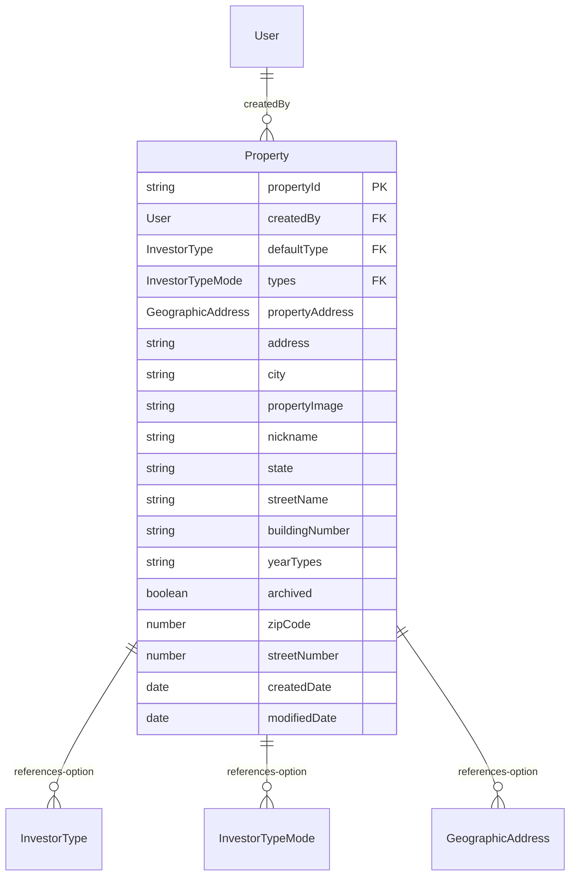
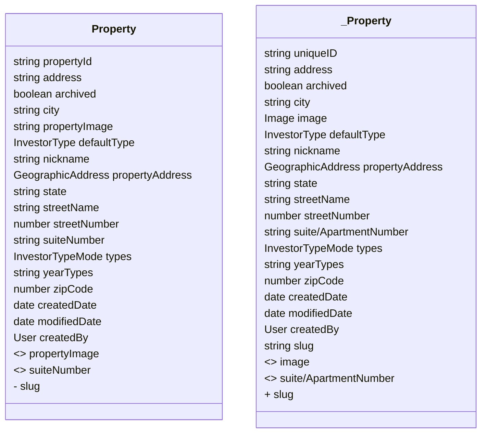

# Property Migration Details 

## Table Of Contents
- [Notable Questions](#notable-questions)
- [Diagram Details](#diagram-details)
- [Bubble Diff](#bubble-diff)

## Notable Questions

- Geographic Address can either be a seperate table entity or a series of values on top of the property object.  The frequency of access to this pattern is probably the most useful information for making that decision, so I wanted to review it over. I presume its a grab once, never grab again value, so it may be fine on the object directly.

### Diagram Details

### Bubble Diff

