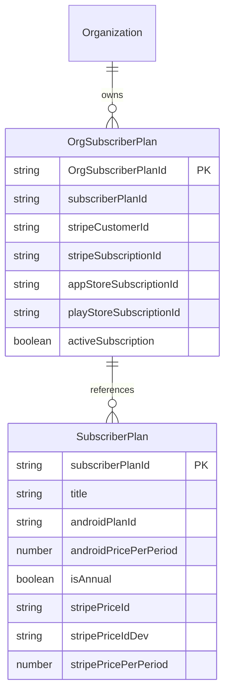

# Subscriber Plan Migration Details 

## Table Of Contents
- [Diagram Details](#diagram-details)

### Diagram Details

```mermaid
erDiagram

Organization ||--o{ OrgSubscriberPlan : owns
OrgSubscriberPlan ||--o{ SubscriberPlan : references

SubscriberPlan {
	string subscriberPlanId PK
    string title
	string androidPlanId
	number androidPricePerPeriod
	boolean isAnnual
	string stripePriceId
	string stripePriceIdDev
	number stripePricePerPeriod
}

OrgSubscriberPlan {
	string OrgSubscriberPlanId PK
	string subscriberPlanId
    string stripeCustomerId
    string stripeSubscriptionId
    string appStoreSubscriptionId
    string playStoreSubscriptionId
    boolean activeSubscription
}
```

