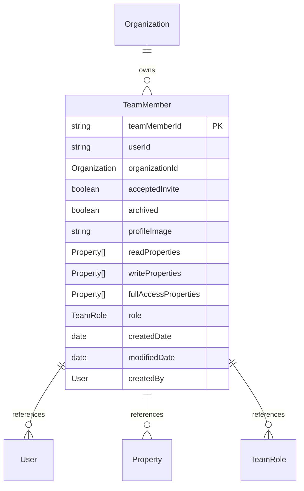

# Team Member Migration Details 

## Table Of Contents
- [Notable Questions](#notable-questions)
- [Diagram Details](#diagram-details)

## Notable Questions

- For the Team Member type, I presume we are utilizing the image value in bubble as a profile image of some variation.  Since the User object and the Team Member object are inherently different, would we want to keep the user profile as an org level value, or a system wide value.
- In Regards to the Team Member Object, currently the permissions are stored directly on the object, the new DB design needs to account for an seperate table for handling permissions for the sake of accounting for dynamic permissions.

### Diagram Details

