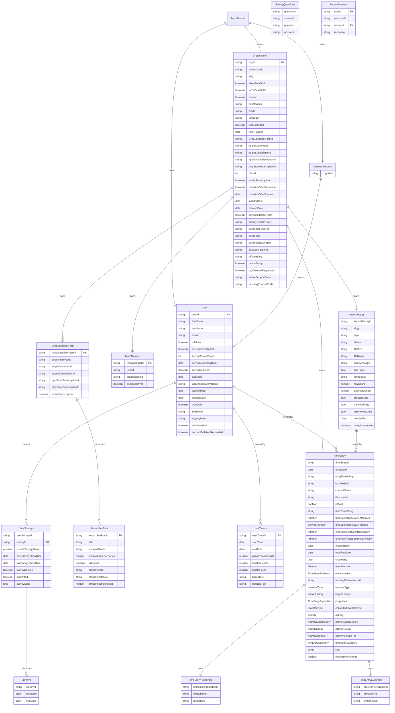

# Database Diagram

```mermaid
erDiagram
RepsTracker ||--|| User : owns
RepsTracker ||--|| Organization : owns
RepsTracker ||--|| CognitoAccount : owns
CognitoAccount ||--|| User : owns
Organization ||--|| TeamMember : owns
Organization ||--|| TimeEntry : owns
Organization ||--|| ImportHistory : owns
Organization ||--o{ OrgSubscriberPlan : owns

RepsTracker {}

CognitoAccount {
    string cognitoId
}

Organization {
    string orgId PK
    string ownerUserId
    string slug

    boolean allowBetaOptIn
    boolean forceBetaOptIn

    boolean banned
    string banReason

    string mode
    string StrTarget

    boolean trialExtended
    date freeTrialEnd

    string OrgSubscriberPlanId

    string stripeCustomerId
    string stripeSubscriptionId
    string appStoreSubscriptionId
    string playStoreSubscriptionId
    int planId
    boolean activeSubscription

    boolean retentionOfferRedeemed
    date retentionOfferExpires 

    date lastModified
    date createdDate

    boolean advancedLtrStrTools
    string activitySystemType

    string boxTempFolderId
    string boxToken
    string boxTokenExpiration
    string boxUserFolderId

    string affiliateSlug
    boolean needsSetup
    boolean orgDeletionRequested
    string activeCouponCode
    string pendingCouponCode
}

OrgSubscriberPlan ||--o{ SubscriberPlan : references
SubscriberPlan {
	string subscriberPlanId PK
    string title
	string androidPlanId
	number androidPricePerPeriod
	boolean isAnnual
	string stripePriceId
	string stripePriceIdDev
	number stripePricePerPeriod
}

OrgSubscriberPlan {
	string OrgSubscriberPlanId PK
	string subscriberPlanId
    string stripeCustomerId
    string stripeSubscriptionId
    string appStoreSubscriptionId
    string playStoreSubscriptionId
    boolean activeSubscription
}
	
UserTimers {
	string userTimerId PK
	date startTime
	date endTime
	number pauseTimeAccrual
	number timeInMinutes
	number timeInHours
	string hoursText
	string minutesText
}

TeamMember {
	string teamMemberId PK
	string userId
	string organizationId
	boolean acceptedInvite
}
	

User ||--o{ UserSurveys : creates
User ||--o{ TimeEntry : createdBy
User ||--o{ UserTimers : createdBy
User {
    string userId PK
    string firstName
    string lastName
    string email

    boolean isAdmin

    boolean surveySubmitted50
    int surveyShownCount
    date surveyNextShowDate
    boolean surveyDeclined

    date lastSeen
    string lastChangeLogVersion
    date lastModified
    date createdDate

    boolean betaOptIn

    string ZoldEmail
    string loggingLevel

    boolean isOnboarded
    boolean accountDeletionRequested
}


ImportHistory ||--o{ TimeEntry : createdBy
ImportHistory {
	string importHistoryId
	string slug
	
	string type
	string status
	string fileSize
	string fileName
	string errorMessage
	
	date endTime
	
	string longStatus
	
	number rowCount
	number duplicateCount
	
	date createdDate
	date modifiedDate
	date lastViewedDate
	User createdBy
	
	boolean usingLowercase
	
}

TimeEntry ||--|| TimeEntryProperties : owns
TimeEntry ||--|| TimeEntryEvidence : owns


TimeEntry {
	string timeEntryId
	
    date entryDate
	string entryDateString
	
	string boxFolderId
	
	string contentStatus
	string description
	
	boolean isDraft

	string timeZoneString
	
	number timeSpentOnActivityInMinutes
	derivedNumber timeSpentOnActivityInHours
	number enteredHoursSpentOnActivity
	number enteredMinutesSpentOnActivity
	
	date createdDate
	date modifiedDate
	User createdBy
	
	Member teamMember
	
	TimeEntryEvidence evidenceList
	string missingFileNamesList
	
	InvestorType investorType
	ImportHistory importHistory
	
	TimeEntryProperties properties
	InvestorType convertedInvestorType
	Activity activity
	ActivitySubcategory activitySubcategory
	ActivityGroup activityGroup
	ActivityGroupSTR activityGroupSTR

    TimEntryCategory timeEntryCategory
	
	string slug
	boolean newActivityFormat
}
	
TimeEntryProperties {
	string timeEntryPropertiesId
	string timeEntryId
	string propertyId
}

TimeEntryEvidence {
	string timeEntryEvidenceId
	string timeEntryId
	string evidenceUrl
}

UserSurveys ||--o{ Surveys : references
Surveys {
	string surveyId
    date startDate
    date endDate
}

SurveyQuestions {
    string questionId
    string surveyId
    string question
    string answers
}

SurveyAnswers {
    string userId PK
    string questionId
    string surveyId PK
    string response
}

UserSurveys {
	string userSurveyId
	string surveyId PK
	number numOfSurveyShown
	date nextSurveyShowDate
	date lastSurveyShowDate
	boolean surveyDecline
	boolean submitted
	
	blob surveyState
}
```