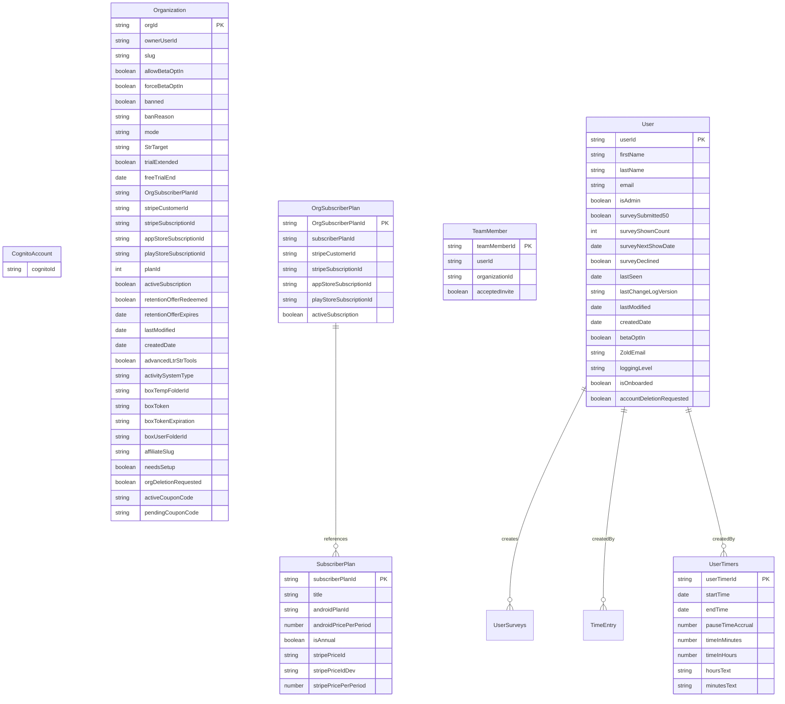

# Repstracker Migration Notes

[Survey Migration Details](#survey)

## Notable Questions
- What is survey state and where can I reference it? It came up in one of my searches last week, but this week when looking for it, I couldn't find any specifics on it. 

### Team Member Pattern

### Survey

Survey Answers Original supports 2 answer fields.  To combat this, we need to create Survey Questions and Survey IDs. 

The Survey Answers object will contain a list of responses to surveys, for each question, for each user, attached to an ORG ID.

The Survey Questions object will contain a list of question for each survey, attached to an org ID.

The UserSurveys object will handle survey information for users, and store data related to when to show surveys based on previous survey display history.

